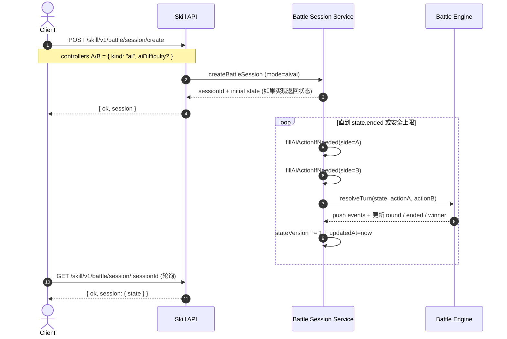

# 双方都是 AI（AIVAI）流程图与数据说明

该文档面向两种读者：

- 你要把客户端做成“全自动 AI 对战”，不希望每回合都手动提交动作
- 你要理解 AIVAI 下服务端内部会用哪些数据做决策，以及最终状态/结果从哪里读

## 1) AIVAI 的参与方

- `Client(AI)`: 创建 session、轮询状态（可选：用于战报/调试）
- `Skill API (hono /skill/v1)`: 路由层（鉴权、参数校验）
- `Battle Session Service`: 会话状态机与并发控制
- `Battle Engine`: `resolveTurn()` 进行逐回合计算
- `AI Planner (server-side)`: `decideBattleAiAction()`（从当前 `state + config + side` 推导动作）

## 2) AIVAI 时序图（双方 ai，无需客户端每回合 submit）

## 3) AIVAI 的“相关数据”从哪里拿、含义是什么

### 3.1 创建请求里决定“全自动”的字段

- `controllers.A.kind = "ai"`
- `controllers.B.kind = "ai"`
- 可选：`aiDifficulty: "easy" | "medium" | "hard"`
- 服务端会据此推断 `inferBattleMode()` => `aivai`

### 3.2 会话里有哪些字段对调试/解释最有用

- `session.state.teamA / teamB`：当前双方上场/替补宠物状态（hp、alive、attribute、activeIndex）
- `session.state.events`：事件流（damage/ko/switch/auto_switch/battle_end）
- `session.state.skillReadyRoundBySide`：普通技能冷却就绪轮
- `session.state.comboReadyRoundBySide`：连携冷却就绪轮
- `session.state.battleParams`
  - `bondDamageBonusPerLevel`
  - `bondCritRatePerLevel`
  - `critMultiplier`
- `session.stateVersion`：用于你在客户端轮询后判断“是否看到了更新”

### 3.3 动作是如何被生成的（客户端无需构造）

- AIVAI 下服务端会调用内部的 AI 决策函数，填充 `session.pendingActions[A]` 与 `session.pendingActions[B]`
- 一旦 A/B 两侧都有 pending action，服务端就执行 `resolveTurn(state, actionA, actionB)`
- action 仍然符合引擎 schema（`skill/combo/switch`），只是动作的选择由服务器负责

## 4) 为什么选择“服务端内部自动推进”的方案

1. 避免客户端协同复杂度
   - AIVAI 不需要客户端每回合提交双方动作，因此不需要维护 A/B 两边并发提交与 `expectedStateVersion` 的一致性
2. 让回合解算更可控
   - `resolveTurn()` 的输入总是同一个 `state` 快照（由服务端持有），减少“客户端看旧 state 再提交”的错误概率
3. 便于统一 fallback
   - 当决策失败或异常时，服务端可以走规则 fallback 保底，保证对局能结束（避免卡死）

## 5) 使用 AIVAI 的注意点（容易踩坑）

1. 客户端通常只需要轮询，不需要 submit
   - 你的系统应设计成：`create -> poll until ended`，不要在 AIVAI 中频繁调用 `/submit`
2. 安全上限存在
   - 服务端内部会限制循环次数（避免死循环/极端情况），所以客户端最终应以 `state.ended` 为准
3. Neo4j 可能不会写入长期成长
   - 当前持久化逻辑只对 `human` side 生效；双方都是 AI 时一般不会触发玩家成长/羁绊写入
   - PvP Elo 更新也只在 PvP 且双方都是人类时才会触发
4. 事件流可能较长
   - `state.events` 作为调试很有用，但不要在高频轮询时把它当“实时 UI 数据源”；建议只在对局结束后汇总叙述

