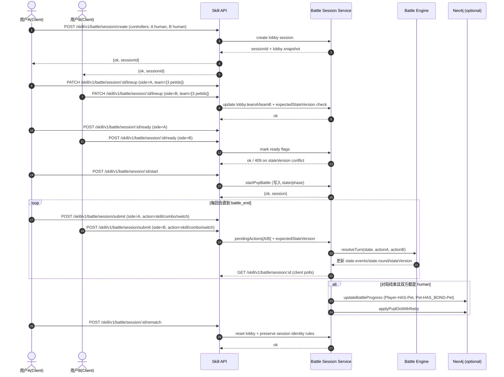
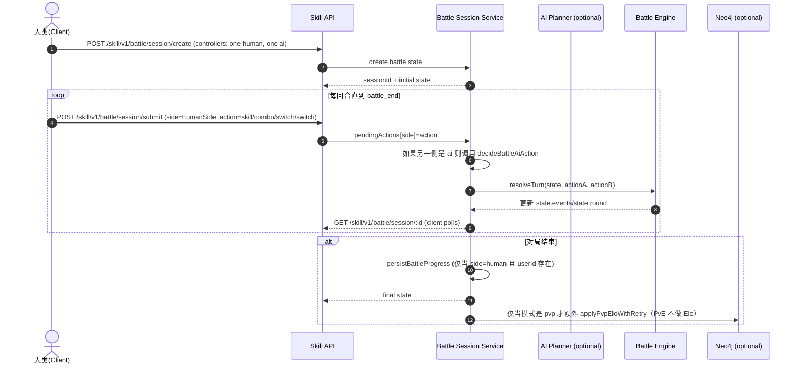
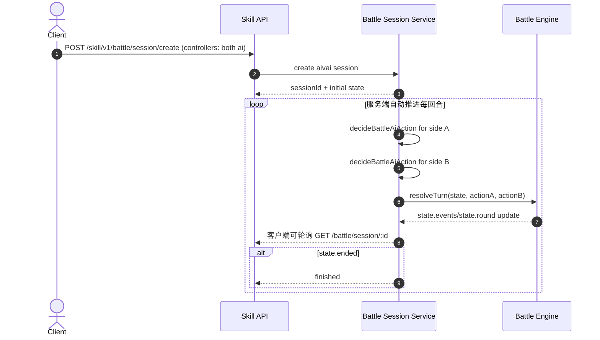

# 游戏时序图与流程图（端到端）

本文件用图把“用户/AI 端如何驱动对局”与“服务端如何逐回合推进状态”讲清楚。图默认以 `Skill layer` 的路由为主（也可对照 root API：去掉 `/skill/v1` 前缀）。

## 0) 参与者（Actors）

- `Client(AI/Web/OpenClaw/Doubao)`: 发起选择阵容、提交动作、轮询状态
- `Skill API`: `/skill/v1` 路由层（认证、参数校验）
- `Battle Session Service`: 会话创建、锁/并发控制、回合推进、超时托管
- `Battle Engine`: `resolveTurn()` 计算本回合效果（伤害/换人/连携/连招冷却等）
- `AI Planner (optional)`: `POST /skill/v1/ai/battle/legal-actions` / `next-action`（或服务端内部 `decideBattleAiAction`）
- `Neo4j (optional)`: 只在对局结束时写入长期成长/羁绊/Elo

---

## 1) PvP 时序图（大厅 -> 选阵 -> 准备 -> 开战 -> 对局 -> Rematch）

> 说明：PvP 创建需要登录，并且大厅阶段不一定有 `BattleState`（具体由 phase 决定）。



## 1.1 PvP 状态机（Phase / Status）

- `phase: "lobby"`：允许 `lineup` / `ready`，尚未开始回合计算
- `phase: "battle"`：开始 `start` 后进入回合推进
- `status: "pending" | "running" | "finished"`：用于服务端运行态（内部状态），对客户端一般以 `state.ended` 为准

## 1.2 并发与一致性（stateVersion）

- 每次回合推进后服务端会 `stateVersion += 1`
- 客户端提交时传 `expectedStateVersion` 用于避免“客户端基于旧 state 提交动作”
- 冲突会返回 `409`（或类似版本错误），客户端应重新 `GET /battle/session/:id` 再提交

---

## 2) PvE 时序图（人类 vs AI）

> 说明：PvE 可以出现“人类超时托管”：超时后服务端把人类一侧委托给 AI 代打（同时仍保留本回合的回合推进一致性）。



## 2.1 人类超时托管（Autopilot）

- 仅在“人类一侧是唯一 human side”时启用（典型 PvE）
- 若客户端在 `humanTurnTimeoutSec` 内未提交，并且该 side 仍等待人类操作，则服务端会触发 AI 代打
- 代打使用 `forceRuleFallback: true`（即在某些情况下走规则 fallback，保证可用性）

---

## 3) AIVAI 时序图（AI vs AI）

> 说明：AIVAI 通常不需要客户端每回合提交动作；服务端内部循环调用 `fillAiActionIfNeeded`，直到 `state.ended` 或达到安全上限（100 轮防止死循环）。



---

## 4) 服务端逐回合流程图（resolveTurn / 动作执行顺序）

```mermaid
flowchart TD
  A([提交条件满足]) --> B{两个 pendingActions 都已存在?}
  B -- 否 --> C([等待下一次 submit 或 autopilot/ai 填充])
  B -- 是 --> D[resolveTurn: 生成本回合 firstSide (随机 50/50)]
  D --> E[按 firstSide 顺序执行 actionA/actionB]
  E --> F[每个 side 的 action 执行: switch / skill / combo]
  F --> G{是否触发 action rejection?}
  G -- 是 --> H[push action_rejected event, 忽略效果]
  G -- 否 --> I{是否需要 maybeProcessKo?}
  I --> J[可能触发 ko -> auto_switch / battle_end]
  J --> K[round += 1; state.events 追加; 标记 ended/winner]
  K --> L[stateVersion += 1; updatedAt=now; status running/finished]
```

## 4.1 关键规则点（客户端要知道的“为什么这样选”）

- 本回合会随机决定 `turn_start.firstSide`，然后按“先 A 还是先 B”的顺序执行两边动作
- `skill` 与 `combo` 都有冷却/可用性约束；失败会产生 `action_rejected` 事件
- `combo` 的执行除了冷却，还要求：
  - 当前出战宠物必须等于 combo 的 `petAId`
  - `petBId` 的搭档在同队且仍 alive
  - 对应无序宠物对的羁绊 `bondLevel >= 3`

---

## 5) 客户端（AI 端）推荐的“决策驱动”流程

虽然客户端最终可以直接提交动作，但最佳实践是：

1. `POST /skill/v1/battle/session/create` 得到 session
2. 循环：
   1. `GET /skill/v1/battle/session/:id` 取最新 `state`
   2. 先调用 `POST /skill/v1/ai/battle/legal-actions`（让服务端帮你过滤“不合法动作”）
   3. 从合法集合里选择 `skill/combo/switch`
   4. `POST /skill/v1/battle/session/submit` 提交，并带上 `expectedStateVersion`

优点：
- 规避 action rejected
- 降低并发冲突（通过 stateVersion 把客户端与服务端同步）

---

## 6) 与 Neo4j 写入的时序关系（为什么对局结束才写）

- 实时回合推进：只改内存里的 `BattleSession.state`
- Neo4j 写入触发在 `persistProgressIfBattleEnded()`：
  - `state.ended` 且对应 side 为 `human` 并且 `userId` 可用
  - PvE 不做 Elo（Elo 仅 PvP）
- Neo4j 失败会被捕获，不阻断客户端对最终战报的读取

---

## 7) 附：对应端点速查

- 会话创建：
  - `POST /skill/v1/battle/session/create`
- 大厅 PvP：
  - `PATCH /skill/v1/battle/session/:sessionId/lineup`
  - `POST /skill/v1/battle/session/:sessionId/ready`
  - `POST /skill/v1/battle/session/:sessionId/start`
- 任意模式逐回合：
  - `GET /skill/v1/battle/session/:sessionId`
  - `POST /skill/v1/battle/session/submit`
- Rematch：
  - `POST /skill/v1/battle/session/:sessionId/rematch`
- 合法行动（AI helper）：
  - `POST /skill/v1/ai/battle/legal-actions`

